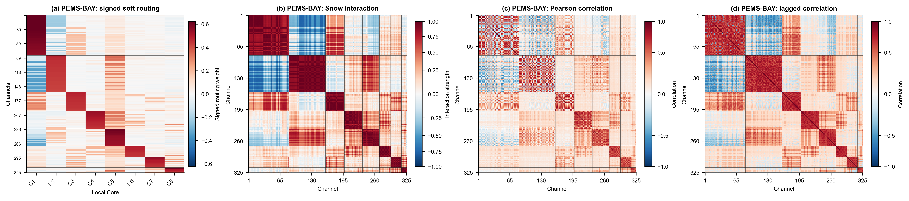
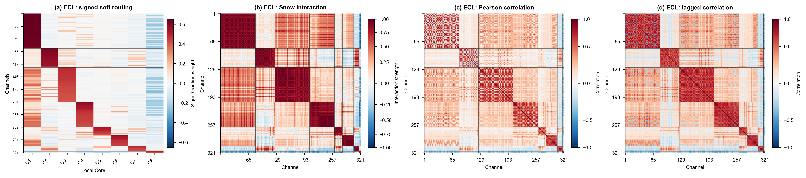
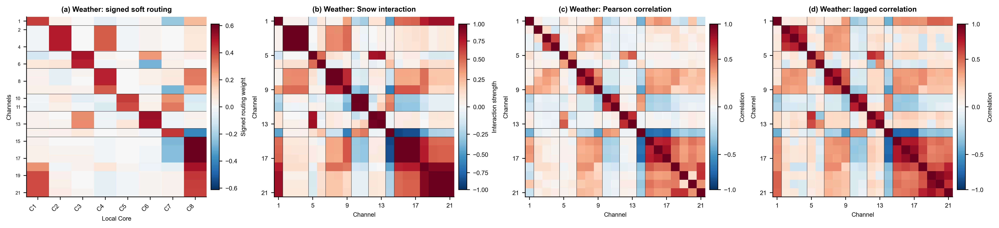

<div align="center">

# Snow Forecasting

**A compact, reproducible code release for Snow and its forecasting baselines**

<sub>Anonymous release · PyTorch · long-term forecasting · high-dimensional traffic forecasting</sub>

</div>

<p align="center">
  
</p>

<p align="center"><sub>Example appendix analysis on PEMS-BAY: signed routing, Snow interaction, and correlation structure.</sub></p>

## At a glance

Snow is a forecasting architecture designed to model signed cross-channel
interactions while retaining a simple long-term forecasting interface. This
repository contains the model variants used in the paper, their baseline
counterparts, the main experiment launchers, and lightweight verification
tests.

| Included | Not included |
| --- | --- |
| Snow and baseline model implementations | Datasets and dataset downloads |
| Standard long-term forecasting runners | Checkpoints and generated results |
| High-dimensional traffic experiment runners | Manuscript sources and review material |
| Data-preparation and smoke-test utilities | Author, server, and repository metadata |

## Visual overview

The appendix analyses below are included as a compact visual guide to the
experiments. They are not required to run the code.

<table>
<tr>
<td width="50%"><br><sub><b>ECL.</b> Signed routing and interaction patterns.</sub></td>
<td width="50%"><br><sub><b>Weather.</b> The same analysis on a low-dimensional dataset.</sub></td>
</tr>
</table>

## Repository layout

```text
run.py                         Main training/evaluation entry point
models/                        Snow and baseline forecasting models
layers/                        Shared neural-network layers
data_provider/                 Dataset readers and preprocessing
exp/                           Training and evaluation loops
configs/                       Non-sensitive experiment configuration
scripts/data/                  High-dimensional traffic data preparation
scripts/experiments/           Main high-dimensional traffic runners
scripts/long_term_forecast/    Main dataset-specific forecasting runners
tests/                         Lightweight model and runner tests
assets/figures/                Appendix figures shown in this README
requirements.txt               Python dependencies
LICENSE                        Release license
```

## Quick start

Create an isolated environment and install the dependencies:

```bash
python -m venv .venv
source .venv/bin/activate          # Windows: activate the .venv environment in PowerShell
python -m pip install -r requirements.txt
```

Datasets are intentionally not bundled. Pass their locations through the
existing `--root_path` argument or environment variables such as `PEMS_ROOT`,
`FORECASTING_ROOT`, and `RESULT_DIR`. Keep outputs, checkpoints, logs, and
temporary files outside the source tree or in ignored directories.

## Main experiment entry points

### Standard forecasting

The dataset-specific wrappers share one interface and use the 96-step input
setting from the paper. For example:

```bash
bash scripts/long_term_forecast/ETT_script/SnowNet_ETTh1.sh
bash scripts/long_term_forecast/ECL_script/SnowNet.sh
bash scripts/long_term_forecast/Traffic_script/SnowNet.sh
```

Additional standard datasets are available under
`scripts/long_term_forecast/` (ETTh2, ETTm1, ETTm2, Solar, Weather, and PEMS).

The GRU baselines are exposed in both channel modes: `GRU_CI` processes each
channel with shared univariate recurrent parameters, while `GRU_CD` receives
the full multivariate input. Their Snow-enhanced counterparts are
`GRU_CI_Snow` and `GRU_CD_Snow`. The legacy names `GRU` and `GRU_Snow` remain
available as aliases for the channel-dependent variants.

### High-dimensional traffic forecasting

The main traffic runner covers the four high-dimensional traffic datasets CA,
GBA, GLA, and SD with the 6-to-6 and 12-to-12 settings. The user-facing
experiment groups are the four named datasets and the forecasting models
selected by `MODELS`.

```bash
bash scripts/experiments/run_highdim_traffic_all_datasets.sh
```

Useful controls are exposed as environment variables, for example:

```bash
DRY_RUN=1 DATASETS="CA GBA" MODELS="SnowNet PatchTST_Snow" \
  bash scripts/experiments/run_highdim_traffic_all_datasets.sh
```

The data-preparation helper converts the raw traffic files into the
memory-mapped layout expected by the repository's traffic loader. The helper
and runner use neutral high-dimensional traffic names throughout.

## Verification

Run the lightweight model and runner checks before launching experiments:

```bash
python -B -m pytest -q
```

Most unit tests use synthetic inputs. The high-dimensional traffic smoke runner
expects converted traffic files under the internal `dataset/highdim_traffic`
loader directory and can be launched with:

```bash
SMOKE_TEST=1 bash scripts/experiments/run_highdim_traffic_all_datasets.sh
```

## Anonymous-release checklist

- No author names, affiliations, email addresses, private URLs, usernames, or
  machine-specific absolute paths are included.
- No datasets, checkpoints, logs, result dumps, manuscript sources, review
  files, or Git metadata are included.
- Dataset and output paths are supplied by arguments or environment variables;
  the scripts contain no local server paths.
- Before archiving, inspect hidden files and rerun a path/privacy scan on the
  final archive.

## License

See [LICENSE](LICENSE). Dataset terms remain the responsibility of the user.
